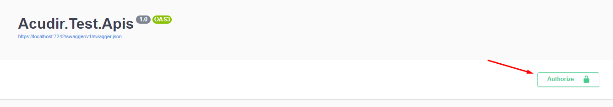

# Acudir.Test.Apis
La API fue desarrollada siguiendo una separación de responsabilidades y una estructura escalable.
Se implementaron los siguientes enfoques y patrones:
- **Mediator Pattern**: Facilita la comunicación entre los componentes, reduciendo el acoplamiento y mejorando la extensibilidad.
- **CQRS (Command Query Responsibility Segregation)**: Divide las operaciones de lectura y escritura para simplificar la lógica y mejorar el rendimiento.
- **Inyección de Dependencias**: Promueve la flexibilidad y la facilidad de pruebas al desacoplar las dependencias de los componentes.

La API está protegida mediante JWT (JSON Web Tokens), lo que asegura la autenticación y autorización de los usuarios.

## Autenticación con JWT (IMPORTANTE)
**Credenciales**:

**username**: Acudir

**password**: AcudirTest

1. *Obtención del Token JWT*:
Después de que el usuario envíe sus credenciales al endpoint de autenticación (/auth/login), el servidor devolverá un token JWT válido. Este token es necesario para acceder a los recursos protegidos de la API.

2. *Incluir el Token en las Peticiones*:
Una vez obtenido el token JWT, debes incluirlo en las cabeceras de cada solicitud HTTP.

3. *Formato del Encabezado Authorization*:
El token JWT se debe enviar con el siguiente formato en la cabecera Authorization:

Authorization: Bearer <tu_token_jwt>

Imagenes de ejemplo:

Se incluye el json para importar la colección de Postman para hacer pruebas:

[json-postman](./ACUDIR%20TEST.postman_collection.json)

## Endpoints

### POST /auth/login

Loguea un usuario a la API y devuelve un JWT.

### GET /people/getAll

Obtiene todos los registros de personas. Permite buscar utilizando todos los filtros disponibles en el modelo `Person`. Todos los filtros son opcionales.

**Ejemplo de uso:**
GET /people/getAll?name=Juan&lastname=Fernandez&age=30

### GET /people/getById

Obtiene el registro de una persona por id.

**Ejemplo de uso:**
GET /people/getById?id=1

### POST /people/create

Agrega un nuevo registro al archivo `Test.json`.

**Parámetros:**
- `name` (string, requerido)
- `lastname` (string, requerido)
- `age` (int, requerido)
- `address` (string, requerido)
- `phone` (string, requerido)

**Ejemplo de uso:**

POST /people/create?name=Juan&lastname=Perez&age=30&address=Alsina 234&phone=555-5555

### PUT /people/update

Modifica un registro existente en el archivo `Test.json`.

**Parámetros:**
- `id` (int, requerido)
- `name` (string, requerido)
- `lastname` (string, requerido)
- `age` (int, requerido)
- `address` (string, requerido)
- `phone` (string, requerido)

**Ejemplo de uso:**
PUT /people/update?id=1&name=Juan&lastname=Perez&age=31

## Estructura del Proyecto

- **Acudir.Test.Apis**: ASP.NET CORE API.
- **Acudir.Test.Core**: Class Library
  - **Application**: Capa de lógica (DTOs, Handlers)
  - **Domain**: Entidades e interfaces
  - **Infrastructure**: Capa de acceso a datos (Commands, Queries, Repository, Services)
- **Acudir.Test.UnitTest**: Contiene los tests de los endpoints
